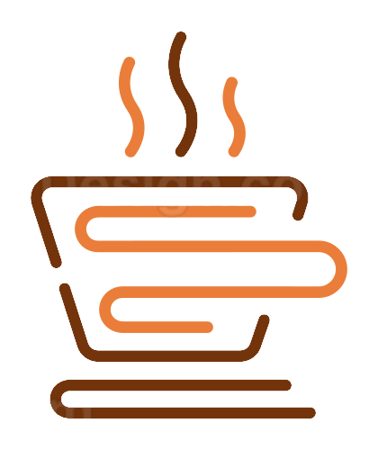
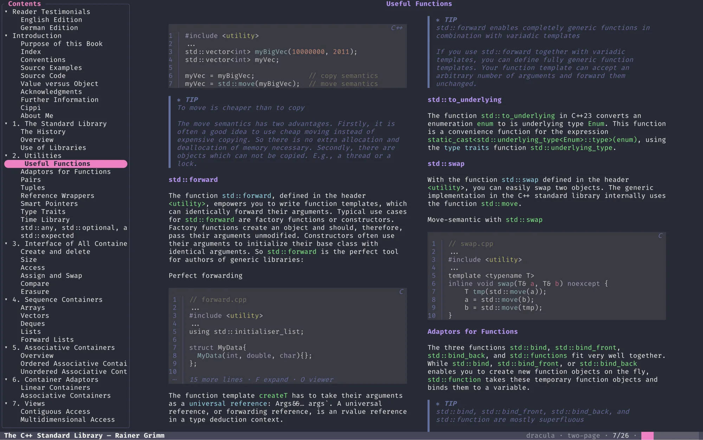
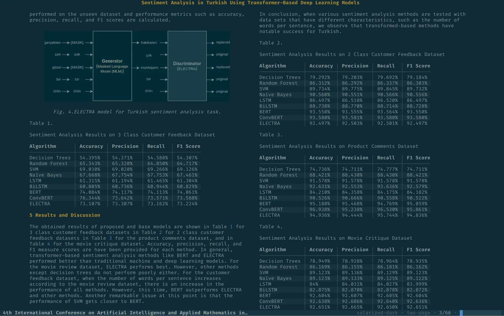

<div align="center">

<h1>
  <picture>
    <source media="(prefers-color-scheme: dark)" srcset="docs/logo-dark.png">
    
  </picture>
  &nbsp;delryn
</h1>

A fast, keyboard-driven terminal reader for EPUB, PDF, and MOBI / AZW3 — with real
graphics: syntax-highlighted code, tables, inline figures, and typeset math.

[](https://github.com/dilmun/delryn/actions/workflows/ci.yml)
[](LICENSE)
[](https://www.rust-lang.org)
[](https://github.com/sponsors/dilmun)

<br />

<picture>
  <source media="(prefers-color-scheme: dark)"  srcset="docs/screenshots/dark/hero.webp">
  <source media="(prefers-color-scheme: light)" srcset="docs/screenshots/light/hero.webp">
  
</picture>

<sub>Syntax-highlighted code, a live table of contents, and a two-page spread — and it follows your terminal's light or dark theme.</sub>

</div>

<div align="right">
<details>
<summary>See more screenshots</summary>

<div align="center">

<br />

<picture>
  <source media="(prefers-color-scheme: dark)"  srcset="docs/screenshots/dark/tables.webp">
  <source media="(prefers-color-scheme: light)" srcset="docs/screenshots/light/tables.webp">
  
</picture>

<sub><b>Tables &amp; figures</b> — real tables and inline diagrams, in a two-page spread</sub>

<br /><br />

<sub>Captured on <a href="https://ghostty.org">Ghostty</a>, which renders real inline graphics.</sub>

</div>
</details>
</div>

---

## Features

**Formats &amp; rendering**
- EPUB (reflowable), PDF (page-image), and MOBI / AZW3
- Syntax-highlighted code (syntect), real tables, and footnotes &amp; cross-references
- Inline figures &amp; diagrams, and **typeset math** — LaTeX *and* MathML, laid out by a
  built-in engine and never left blank (typeset → publisher figure → Unicode)
- DPI-independent equation &amp; image sizing, with theme-aware image recolour

**Reading**
- Single column or **two-page spread**, which turns a whole spread at a time
- **Page mode** (turn whole pages) and **continuous scroll** (chapters flow together)
  as independent settings, in either view
- Justified text with **hyphenation** (English patterns) and optimal (Knuth–Plass) line
  breaking, and a capped measure so a maximised terminal still reads like a page
- **RTL (manga)** direction, per-chapter lock, and a distraction-free focus mode
- Jump by element type (code · table · math · figure); vim motions with counts
- Code folding, plus fullscreen code and figure browsers

**PDF**
- Continuous page stacking, zoom / pan, fit modes (page / width / height), and margin trim

**Annotations, search &amp; lookup**
- Bookmarks, colour highlights, and notes, in a tabbed annotations browser
- **Vim-style visual selection** to copy, highlight, or note a range; Markdown export
- A highlight **pen** — the selection is washed in the colour before you commit it, so
  you pick by looking at it rather than blind
- In-book search — **plain, regex, or fuzzy** — with match navigation and history
- Word lookup (`K`) — dictionary and Wikipedia, with translation

**Library**
- Multi-folder sources with background scanning, and a **"find my books"** search that
  proposes the folders in your home directory that hold books, with counts, to add in one go
- Sections (Recent, Favorites, Currently Reading, Series, Duplicates) and **collections / shelves**
- Ratings, reading status, and tags; list, compact, or **cover-grid** layouts
- CSV export, statistics, and **duplicate detection** (metadata + deep cover-hash)
- Metadata editor with **Open Library** lookup for details and cover art

**Interface**
- 9 built-in themes (auto, dark, oled, high-contrast, solarized dark / light, dracula, gruvbox, light) plus custom TOML
- Command palette (`:`), a configurable status bar, and full mouse support

---

## Requirements

delryn's text UI runs in any terminal, but **images, PDF pages, and graphical math need a
terminal that speaks the Kitty graphics protocol.** Without one, EPUB / MOBI text still reads
fine — figures fall back to placeholders, graphical math to a Unicode approximation, and PDF
won't open.

> [!IMPORTANT]
> delryn is developed and tested on [Ghostty](https://ghostty.org). Other Kitty-protocol
> terminals (Kitty, iTerm2, WezTerm) should work but aren't verified yet — broader terminal
> support is planned.

> [!NOTE]
> **tmux / screen** intercept the graphics protocol, so images and PDF render blank inside
> them — run delryn outside a multiplexer for now (passthrough is planned). PDFs are parsed by
> PDFium in-process and unsandboxed, as in most desktop readers — open PDFs you trust.

> [!NOTE]
> **What talks to the network.** Only two things, both on demand and both optional: the
> metadata/cover editor (Open Library, Google Books) and word lookup `K`. Lookup queries the
> **Free Dictionary API** and **Wikipedia** by default and **translation is off** by default;
> each is an independent toggle in Settings ▸ Lookup, and turning all three off — or installing
> `sdcv` for offline StarDict lookup — makes delryn fully offline. Nothing is sent in the
> background, and there is no telemetry.

---

## Install

### Prebuilt binaries

Download your platform's tarball from the [**Releases**](https://github.com/dilmun/delryn/releases)
page. **Nothing to install and nothing to configure** — PDF support is built into the binary, so
you can move `delryn` anywhere on your `PATH` and it keeps working:

```sh
tar xzf delryn-<version>-<target>.tar.gz
cd delryn-<version>-<target>
./delryn
```

Prebuilt targets: Linux `x86_64`, macOS `arm64` &amp; `x86_64`. Each archive ships a `.sha256` to verify.

> [!NOTE]
> **macOS Gatekeeper.** The binaries aren't notarized, so clear the quarantine flag once:
> `xattr -d com.apple.quarantine ./delryn`

### From source

Requires Rust **1.85+** (edition 2024):

```sh
git clone https://github.com/dilmun/delryn
cd delryn
cargo build --release
./target/release/delryn
```

A source build has **no PDF support out of the box** — release binaries embed `libpdfium`, but
`cargo build` can't. EPUB and MOBI/AZW3 read fine; for PDF, drop a `libpdfium` beside the binary
or point `DELRYN_PDFIUM_DIR` at one. [`docs/RELEASING.md`](docs/RELEASING.md#libpdfium) has the
pinned build and a copy-paste setup.

---

## Usage

```sh
delryn                       # open the library
delryn path/to/book.epub     # open a book straight away (EPUB / PDF / MOBI / AZW3)
delryn ~/Books ~/Papers      # register folder(s) as library sources, then open
delryn --add <dir>…          # register + index folder(s), no UI  (also: -a)
delryn --rescan              # re-read metadata for every book, prune missing files
delryn --index               # build the full-text search index
delryn --export-annotations  # dump all notes & bookmarks as Markdown to stdout
delryn --clear-cache         # delete cached page / figure / equation images
delryn --help                # usage  (also: -h)   ·   --version / -V
```

Don't know where your books are? Press `;` ▸ **Sources** ▸ *Find my books* (or `:` ▸ *Find my
books*) and delryn searches your home folder, then offers the folders that hold books — with a
count each — for you to tick.

Registered folders **re-sync by themselves**: every launch runs a background scan that picks up
new and changed books and forgets ones whose files are gone. It's incremental, so a large library
costs little. `Rescan now` on the Sources tab (or `delryn --rescan`) forces a full re-read and
also drops books that no longer sit under any configured folder. Books on an unmounted drive are
kept, not pruned.

---

## Key bindings

Vim-style and count-aware (`10j`, `50G`). Every screen shows its own legend in the status bar —
the essentials:

<details open>
<summary><b>Reader — navigation</b></summary>

| Key | Action |
| --- | --- |
| `j` `k` · `↓` `↑` | line down / up |
| `Space` · `Ctrl-f` `Ctrl-b` | page down / up |
| `Ctrl-d` `Ctrl-u` | half-page down / up |
| `gg` · `G` | top · bottom (`NG` → page/section N) |
| `J` `K` | next / previous chapter |
| `Ctrl-o` `Ctrl-p` | jump-list back / forward |
| `w` `b` | next / prev rich element (code · table · math · figure) |
| `Tab` · `s` | focus / toggle the table-of-contents sidebar |
| `/` · `n` `N` | search (plain / regex / fuzzy) · next / prev match |
| `q` · `Q` | back to library · quit |
</details>

<details>
<summary><b>Reader — layout, modes &amp; PDF</b></summary>

| Key | Action |
| --- | --- |
| `v` | center ⇄ two-page |
| `p` | page mode — turn whole pages ⇄ scroll by rows (continuous flow is a setting) |
| `c` | chapter lock — stop at the chapter edge instead of flowing on |
| `t` · `M` | cycle theme · reading preset (Default / Study / Research / Presentation) |
| `[` `]` · `{` `}` | margin narrower / wider · line spacing |
| `f` · `z` | focus (distraction-free) mode · toggle status bar |
| `+` `-` `0` · `W` · `x` | (PDF) zoom / reset · fit mode · margin trim |
</details>

<details>
<summary><b>Reader — annotations &amp; selection</b></summary>

| Key | Action |
| --- | --- |
| `m` · `H` · `a` | bookmark · highlight (repeat to recolour) · note |
| `'` | open annotations browser (Bookmarks / Notes / Highlights) |
| `V` | cursor / visual selection (`v` or `Space` anchors it; `Esc` leaves) |
| ↳ in `V` | `y` copy · `c`/`Tab` step the pen · `⏎`/`H` highlight · `1`–`5` pick a colour |
| ↳ in `V` | `a` note · `m` bookmark the line · `K` look the word or phrase up |
| `I` · `O` | figure browser · code browser (fullscreen, scroll + copy) |
| `Z` · `F` | fold all long code · pick a visible code block to fold (`1`–`9`) |
</details>

<details>
<summary><b>Library</b></summary>

| Key | Action |
| --- | --- |
| `h` `j` `k` `l` · `Enter` `o` | move · open |
| `/` · `s` `S` | filter · sort / reverse |
| `f` · `0`–`5` · `m` | favorite · rate · reading status |
| `e` · `T` · `c` | edit metadata · tags · add to collection |
| `v` · `+` `-` | cycle layout (list / compact / grid) · grid card size |
| `Space` `V` `A` | mark · visual-range · mark all |
| `r` | rename the file |
| `D` · `R` · `I` | resolve duplicates · deep content scan · ignored groups |
| `:` · `i` · `;` | command palette (incl. "Find my books") · statistics · settings |
| `?` | key reference — every binding for the current screen |
| `Delete` | move to trash (with confirm) |
</details>

---

## Configuration

delryn reads `~/.config/delryn/config.toml` (TOML), but everything is also editable **live in the
app** — press `;` for the Settings overlay, which writes the file on close (atomically, and
owner-only: the config and the library database hold your reading history, notes and
highlights). Highlights: theme,
typography (margins, max text width, line &amp; paragraph spacing, justify, hyphenation),
pagination (page mode, continuous scroll, chapter lock), reading mode &amp; direction, image / math
scaling, PDF trim, `cache_limit_mb` (disk ceiling for cached page/figure images — default 512 MB,
`0` for unlimited), and a `[status]` block to compose the status bar (per-zone segment order,
separator, clock). The same folder holds the library database, cover cache, and `themes/` for
your own `*.toml` themes.

---

## Contributing &amp; releases

Branch → PR → squash-merge, with the **PR title a [Conventional Commit](https://www.conventionalcommits.org)**.
Releases are automated — merge the standing release PR to publish. The full workflow, the
commit / version / changelog conventions, and the pipeline internals live in
[**`docs/RELEASING.md`**](docs/RELEASING.md).

Before pushing, run the same gate CI does:

```sh
cargo fmt --all --check
cargo clippy --workspace --all-targets -- -D warnings
cargo test --workspace
```

---

## License

[MIT](LICENSE) © 2026 dilmun

<sub>Built on ratatui, syntect, pdfium, RaTeX, hypher, and the epub / scraper / image crates — thank you to those projects.</sub>

<div align="center">
<br />
<a href="https://github.com/sponsors/dilmun"><b>Sponsor delryn</b></a>
</div>
