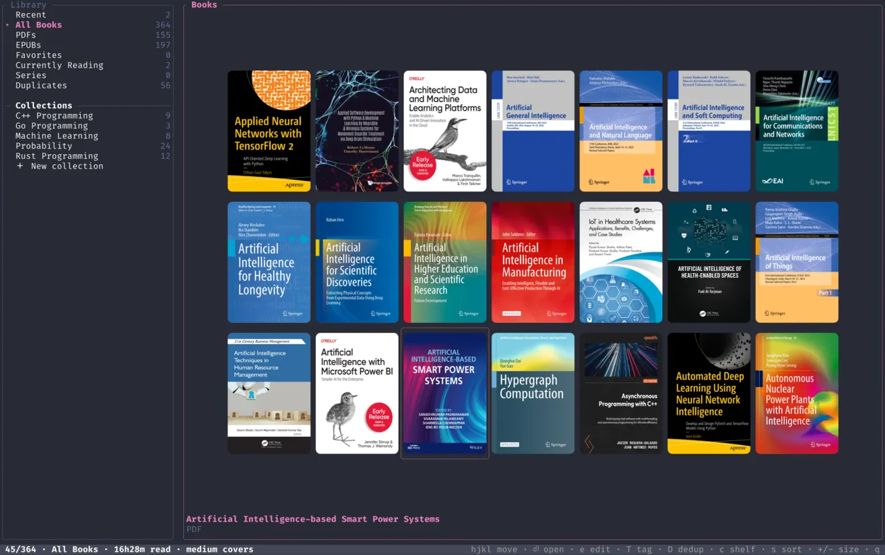

<div align="center">

# delryn

**A fast, keyboard-driven terminal reader for EPUB · PDF · MOBI / AZW3 — with real graphics.**

[](https://github.com/dilmun/delryn/actions/workflows/ci.yml)
[](LICENSE)
[](https://www.rust-lang.org)
[](https://ratatui.rs)
[](https://github.com/sponsors/dilmun)



</div>

---

delryn reads your whole library from the terminal and renders what most TUI readers can't —
**syntax-highlighted code, real tables, inline figures & diagrams, and graphical LaTeX math**,
straight through the terminal's graphics protocol — alongside a full **library manager** with
cover art, collections, ratings, and duplicate detection.

## Features

- **Formats** — EPUB (reflowable), PDF (page-image), and MOBI / AZW3.
- **Rich rendering** — syntax-highlighted code (syntect), tables, footnotes & cross-references, inline figures, and **graphical LaTeX math** (RaTeX → images).
- **Reading** — continuous scroll or paged / page-flip; single column or **two-page spread**; **RTL (manga)** direction; per-chapter lock; distraction-free focus mode; jump-by-type (`w`/`b` across code / table / math / figure); vim motions with counts.
- **PDF** — continuous page stacking, zoom / pan, fit modes (page / width / height), margin trim.
- **Annotations** — bookmarks, colour highlights, and notes; a tabbed annotations browser; **vim-style visual selection** (`V`) to copy / highlight / note ranges; Markdown export.
- **Search** — in-book **plain / regex / fuzzy**, with match navigation and history.
- **Library** — multi-folder sources with background scanning; sections (Recent, Favorites, Currently Reading, Series, Duplicates); **collections / shelves**; ratings, reading status, tags; list / compact / **cover-grid** layouts; CSV export; statistics; **duplicate detection** (metadata + deep cover-hash).
- **Metadata editor** with **Open Library** online lookup for details & cover art.
- **9 built-in themes** (auto, dark, oled, high-contrast, solarized dark / light, dracula, gruvbox, light) + your own; theme-aware image recolour.
- **Command palette** (`:`), configurable status bar, and full mouse support.

## Requirements

delryn's text UI runs in any terminal, but **images, PDF pages, and graphical math need a
terminal that speaks the Kitty (or iTerm2) graphics protocol** — e.g. **Kitty**, **Ghostty**,
or **iTerm2**. Without one, EPUB / MOBI text still reads fine; figures fall back to
placeholders, graphical math to a Unicode approximation, and **PDF won't open** (it renders as
page images).

- A graphics-capable terminal (Kitty / Ghostty / iTerm2) — for images, PDF, and math.
- **PDF** also needs **libpdfium** — bundled in the release tarballs; for source builds, see below.

## Install

### From a release (recommended)

Download the tarball for your platform from the [**Releases**](https://github.com/dilmun/delryn/releases)
page — each bundles the matching `libpdfium`, so PDFs work out of the box:

```sh
tar xzf delryn-<version>-<target>.tar.gz
cd delryn-<version>-<target>
./delryn
```

Prebuilt targets: Linux `x86_64`, macOS `arm64` & `x86_64`. Each archive ships a `.sha256` to verify.

### From source

Needs Rust **1.85+** (edition 2024):

```sh
git clone https://github.com/dilmun/delryn
cd delryn
cargo build --release
./target/release/delryn
```

For PDF support from a source build, place a `libpdfium` shared library beside the binary (or
install one system-wide) — [`docs/RELEASING.md`](docs/RELEASING.md) notes the exact build delryn pins.

## Usage

```sh
delryn                       # open the library
delryn path/to/book.epub     # open a book straight away (EPUB / PDF / MOBI / AZW3)
delryn ~/Books ~/Papers      # register folder(s) as library sources, then open
delryn --add <dir>…          # register + index folder(s), no UI  (also: -a)
delryn --rescan              # re-read metadata for every book, prune missing files
delryn --index               # build the full-text search index
delryn --export-annotations  # dump all notes & bookmarks as Markdown to stdout
```

### Key bindings

Vim-style and count-aware (`10j`, `50G`). Every screen shows its own legend in the status bar —
the essentials:

<details open>
<summary><b>Reader — navigation</b></summary>

| Key | Action |
| --- | --- |
| `j` `k` · `↓` `↑` | line down / up |
| `Space` · `Ctrl-f` `Ctrl-b` | page down / up |
| `Ctrl-d` `Ctrl-u` | half-page down / up |
| `gg` · `G` | top · bottom (`NG` → page/section N) |
| `J` `K` | next / previous chapter |
| `Ctrl-o` `Ctrl-p` | jump-list back / forward |
| `w` `b` | next / prev rich element (code · table · math · figure) |
| `Tab` · `s` | focus / toggle the table-of-contents sidebar |
| `/` · `n` `N` | search (plain / regex / fuzzy) · next / prev match |
| `q` · `Q` | back to library · quit |
</details>

<details>
<summary><b>Reader — layout, modes & PDF</b></summary>

| Key | Action |
| --- | --- |
| `v` | center ⇄ two-page |
| `p` | paged ⇄ continuous scroll |
| `t` · `M` | cycle theme · reading preset (Study / Research / Presentation) |
| `[` `]` · `{` `}` | margin narrower / wider · line spacing |
| `f` · `z` | focus (distraction-free) mode · toggle status bar |
| `+` `-` `0` · `W` · `x` | (PDF) zoom / reset · fit mode · margin trim |
</details>

<details>
<summary><b>Reader — annotations & selection</b></summary>

| Key | Action |
| --- | --- |
| `m` · `H` · `a` | bookmark · highlight (cycles colour) · note |
| `'` | open annotations browser (Bookmarks / Notes / Highlights) |
| `V` | visual selection → `y` copy · `H`/`1`–`5` highlight · `a` note |
| `i` | figure / image browser |
</details>

<details>
<summary><b>Library</b></summary>

| Key | Action |
| --- | --- |
| `h` `j` `k` `l` · `Enter` `o` | move · open |
| `/` · `s` `S` | filter · sort / reverse |
| `f` · `0`–`5` · `m` | favorite · rate · reading status |
| `e` · `T` · `c` | edit metadata · tags · add to collection |
| `v` · `+` `-` | cycle layout (list / compact / grid) · grid card size |
| `Space` `V` `A` | mark · visual-range · mark all |
| `:` · `i` · `;` | command palette · statistics · settings |
| `Delete` | move to trash (with confirm) |
</details>

## Configuration

delryn reads `~/.config/delryn/config.toml` (TOML), but everything is also editable **live in the
app** — press `;` for the Settings overlay, which writes the file on close. Highlights: theme,
typography (margins, line & paragraph spacing, justify), reading mode & direction, image / math
scaling, PDF trim, and a `[status]` block to compose the status bar (per-zone segment order,
separator, clock). The same folder holds the library database, cover cache, and `themes/` for
your own `*.toml` themes.

## Contributing & releases

Branch → PR → squash-merge, with the **PR title a [Conventional Commit](https://www.conventionalcommits.org)**.
Releases are automated — merge the standing release PR to publish. The full workflow, the
commit / version / changelog conventions, and the pipeline internals live in
[**`docs/RELEASING.md`**](docs/RELEASING.md).

## License

[MIT](LICENSE) © dilmun

<div align="center">
<br />
<a href="https://github.com/sponsors/dilmun"><b>Sponsor delryn</b></a>
</div>
